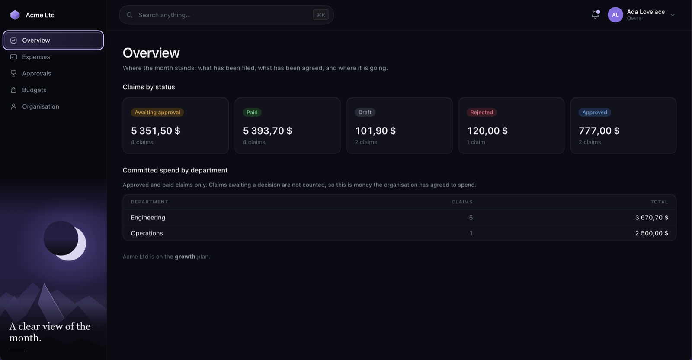
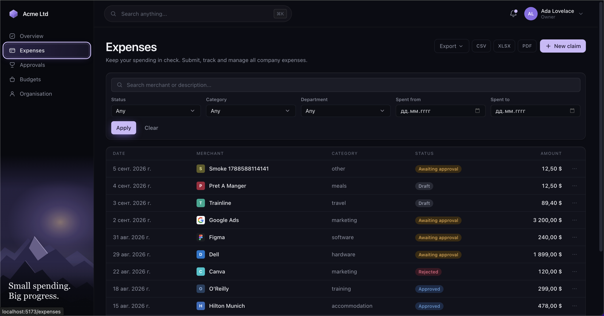
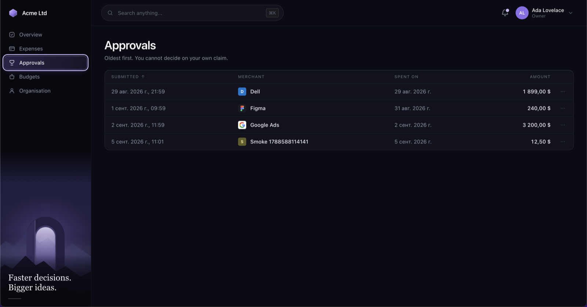
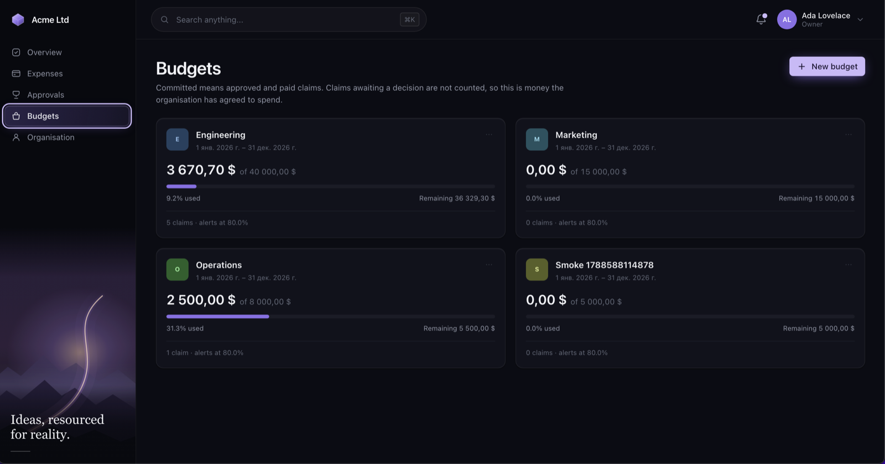
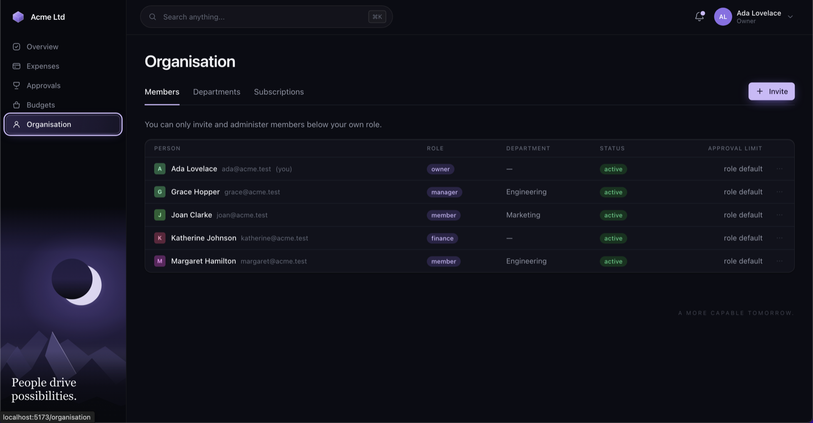
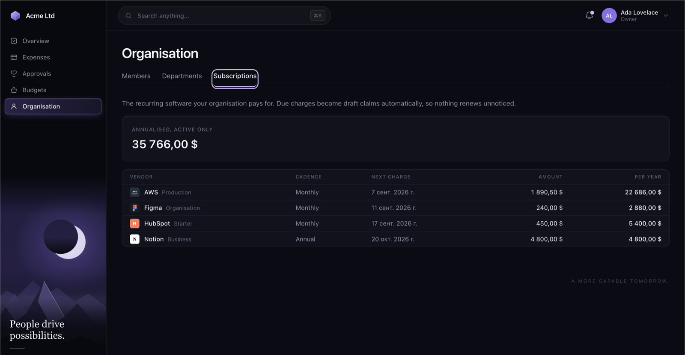

# Multi-Tenant B2B Expense & Team Budget Tracker

Expense claims, department budgets and recurring software spend for small
businesses and agencies. Go, PostgreSQL, one binary for the API and one for the
workers.

**Go 1.25 · PostgreSQL 16 · pgx/v5 · sqlc · chi · Redis + Asynq**

The hard part of a multi-tenant product is not writing `WHERE tenant_id = $1`.
It is that you have to write it in every query, forever, and one omission is a
data breach rather than a bug. So it is not written in the queries at all — it
is enforced by the database, and the Go types are shaped so that a query
without a tenant bound will not compile.

---

## Five things that would break, and don't

Each has a test. Each test was checked by breaking the code and watching it
fail.

### Take away the transaction, and one customer reads another's expenses

The tenant is bound with `set_config('app.tenant_id', $1, true)` — the third
argument is `is_local`, so the setting is reverted by `COMMIT`. On a pooled
connection that is the whole ballgame: a session-level `SET` leaves the last
tenant's id on the connection, and the next checkout — possibly a different
customer, microseconds later — inherits it.

```
--- FAIL: TestBindingDoesNotSurviveTheTransaction
    rls_test.go:281: round 0: a pooled connection came back bound to
        "8f2c...": the next request would inherit this tenant
```

The pool in that test holds four connections and the test runs twenty
transactions, so reuse is certain rather than hoped for.

### Connect as the migration owner, and RLS silently does nothing

PostgreSQL exempts a table's owner from its own policies unless
`FORCE ROW LEVEL SECURITY` is set, and exempts superusers unconditionally. A
deployment pointed at the wrong DSN works perfectly, passes every test, and
isolates nothing — `\d` still lists the policies.

Two things stop it. Every tenant table sets `FORCE`, and the pool refuses to
open at all if its role can see through RLS:

```
fatal: refusing to start: database role "expense" is a superuser and has
BYPASSRLS, so row-level security would not isolate tenants; connect as the
runtime role (expense_app), not the migration owner
```

### Make the isolation policy permissive, and the next feature widens it

Permissive policies are OR-ed together, so adding one for a new feature
*grants* access — and the grant looks like an ordinary feature commit in
review. The isolation policies are `RESTRICTIVE`, which is AND-ed with
everything else, so they can only be removed deliberately.

```
--- FAIL: TestIsolationPoliciesAreRestrictive
    tenant_isolation on expenses is PERMISSIVE; it must be RESTRICTIVE so no
    other policy can widen it
```

### Drop the row lock, and two approvers approve the same claim

`SELECT ... FOR UPDATE NOWAIT` guards the read-decide-write. The
compare-and-swap on `version` would catch a lost update on its own — but only
after the audit row had already been written, because the ledger insert and the
status update are two statements.

```
--- FAIL: TestConcurrentApprovalsProduceOneDecision
    round 0: 2 approvals succeeded, want exactly 1
    round 0: ledger holds 2 approvals, want 1
```

Eight rounds, two racing approvers each.

### Buffer the export, and one customer's download takes the service down

A four-year export is roughly 12 MB of spreadsheet. Buffered, that is 12 MB per
concurrent download and an endpoint whose memory cost is set by the customer's
data volume.

Nothing is buffered. XLSX is a ZIP of XML written straight onto the socket, PDF
holds exactly one page, CSV holds one row:

```
    heap in use: 824 KiB at 1k rows, 4152 KiB at 200k rows   (csv)
    heap in use: 1624 KiB at 1k rows, 4064 KiB at 200k rows  (xlsx)
    heap in use: 1656 KiB at 1k rows, 4312 KiB at 200k rows  (pdf)
```

Two hundred times the rows, the same memory.

---

## How tenancy actually works

Three layers, none of which is trusted to be the only one.

**The token.** The tenant travels in a signed JWT claim. There is no
`X-Tenant-Id` header and no tenant path segment, because either would be a
value the client picks.

**The transaction.** `WithTenantTx` opens a transaction, binds the session, and
hands back a `*TenantConn`. Its `pgx.Tx` is unexported and there is no
constructor, so a repository method taking a `*TenantConn` cannot be called
outside a bound transaction — not by convention, but because the program would
not compile.

```go
err := db.WithTenantTx(ctx, postgres.Binding{TenantID: subject.TenantID}, 
    func(ctx context.Context, tc *postgres.TenantConn) error {
        claim, err := expenses.GetForUpdate(ctx, tc, id)   // needs a *TenantConn
        ...
    })
```

**The database.** Every tenant table carries a `RESTRICTIVE` policy comparing
`tenant_id` against the session variable, with `FORCE` set so the owner is
subject to it too. An unbound session yields `NULL`, `tenant_id = NULL` is not
`TRUE`, and the policy denies every row — unbound reads as *no rows*, never as
*all rows*.

The queries still say `WHERE tenant_id = $1` anyway, filled from
`tc.TenantID()`. That is redundant with RLS on purpose: it gives the planner a
constant on the leading index column, and it keeps the queries isolating if a
policy is ever disabled. Two mechanisms, neither assumed from the other.

The one widening is `WithSystemTx`, for the billing relay and the cross-tenant
sweeps. It is logged at `warn` on every call, and it widens the policies rather
than replacing them.

---

## The approval state machine

```
                    ┌──────────────── withdraw ────────────────┐
                    v                                          │
  (new) ──────> draft ────── submit ──────> pending_approval ──┤
                  ^                              │             │
                  │                     approve  │  reject     │
                  │                         ┌────┴────┐        │
               revise                       v         v        │
                  └───────────────────── rejected   approved ──┘
                                                       │
                                                      pay
                                                       v
                                                     paid  (terminal)
```

Three absences are as deliberate as the edges:

- **`rejected` → `pending_approval` does not exist.** A rejected claim goes
  back through `revise`, which bumps the revision counter. Without that step a
  submitter could re-present an identical claim until an approver clicked the
  wrong button, and the ledger would show two decisions with nothing to tell
  them apart.
- **`approved` → `rejected` does not exist.** Reversing a decision rewrites
  history; a mistaken approval is corrected by a compensating claim, and both
  facts stay in the ledger.
- **`paid` has no outgoing edges.** The money is gone.

Separation of duties is enforced per claim, not just per role. Nobody approves
their own claim, and the approver of a claim cannot also settle it — an owner
holds both permissions, so a role check alone would not stop them.

The transition table is data, not a switch statement, so the tests read it
directly: every state is reachable, every non-terminal state has an exit, and
every `(state, action)` pair is either an edge or an explicit refusal.

---

## Streaming exports

`GET /api/v1/reports/expenses/export?format=xlsx&from=2026-01-01&to=2026-03-31`

CSV, XLSX and PDF, none of them buffered.

XLSX gets the interesting constraint. The conventional layout interns every
string in `sharedStrings.xml` and references them by index — smaller, and it
requires holding every distinct string until the last row is known. This writer
uses `t="inlineStr"` instead and omits `<dimension>`, so the whole document is
append-only and `archive/zip` can push it onto the socket as it is produced.
Amounts are typed numbers with a currency format and dates are real serial
dates, so the file sums and sorts rather than being a grid of text.

PDF cannot stream a page — the content stream's `/Length` precedes its bytes —
so it buffers exactly one page and writes each out as it is finished. The
cross-reference table is built from a byte counter as the file is written,
which is possible because PDF puts `startxref` at the end by design.

Verified against readers that are not this codebase: `openpyxl` with warnings
as errors, and macOS CoreGraphics (the engine behind Preview) for the PDF.

Non-Latin-1 text in the PDF renders as `?`. The base-14 fonts are single-byte
WinAnsi and embedding a font subset is a bigger change than this format
justifies — CSV and XLSX carry the full range.

---

## Billing

The subscription lives in the [Stripe Payment & Subscription
Gateway](https://github.com/mlkad/stripe-payment-service) (project #1). That
service owns the Stripe key, receives Stripe's webhooks and resolves their
ordering; this one keeps a local projection and answers every entitlement check
from it.

Which means the gateway is never called on the request path. A billing outage
cannot lock a customer out of their own expense records, and a customer whose
card is being retried keeps working — `past_due` still grants the plan, because
revoking access during dunning is how a recoverable payment problem becomes a
cancellation.

The relay receiver applies the lesson project #1 learned against Stripe:
**verify the signature before claiming the event id.** The id arrives in the
body and is unauthenticated until then, so claiming first lets anyone POST a
guessed id, plant a settled row, and have the genuine delivery discarded as a
duplicate — answered `200`, never processed.

Full contract, including the two additions it asks of project #1:
[docs/BILLING_INTEGRATION.md](docs/BILLING_INTEGRATION.md).

---

## Receipts

`POST /expenses/{id}/attachments/presign` → client PUTs to the object store →
`POST /expenses/{id}/attachments`

Two steps rather than one multipart upload, because a receipt is up to 25 MiB
and an API that proxied it would hold that much per concurrent upload, spend its
request deadline on the client's connection speed, and put a user-chosen file
through the process that also holds database credentials. The bytes never come
through this service; its whole involvement is one HMAC and one row.

The signature binds the upload to the declared content type and SHA-256, so the
object store — the only party that sees the content — is what verifies it:

```
--- upload with content that does not match the signed checksum
    HTTP 400 XAmzContentChecksumMismatch
```

What a presigned PUT *cannot* carry is a length limit; only the browser POST
policy form can. So the declared size is checked before signing and the stored
size is checked again on confirm, which is the honest version of that
guarantee — a client can waste bucket space once and cannot get a row for it.

Confirm stat-s the object before recording it. Without that the attachment list
would be a set of assertions rather than a set of files: a caller could register
a receipt it never uploaded, or point a row at another tenant's object — and the
object store has no row-level security to stop them reading it afterwards.

Content types are an allowlist of PDF and images. `image/svg+xml` is the one
people forget: an image to a human, a scriptable document to a browser, and a
stored XSS against whoever opens the receipt.

SigV4 presigning is written out in `internal/storage` rather than taken from the
AWS SDK — this service needs one thing from S3 and the SDK is a large surface to
carry for a hundred lines of HMAC. The trade is that a mistake is silent until a
request is rejected, so it is verified against a real MinIO in the integration
suite rather than against my own idea of the algorithm.

---

## Account and organisation settings

`GET /api/v1/me` is the first call a dashboard makes: who the caller is, where
they stand, and their permission list — which the client hides controls by, and
which is a convenience rather than an enforcement point, since every endpoint
checks for itself.

Two things are deliberately **not** editable:

- **The slug.** It appears in bookmarked links and in the sign-in form, and
  renaming it breaks both with no redirect to fix them. That needs an alias
  table and a deprecation window, not a settings field.
- **The currency, once claims exist.** Existing claims keep the currency they
  were captured in, so a change would leave totals summing mixed currencies — a
  number that looks authoritative and means nothing.

Changing a password requires the current one. Without it, a stolen access token
— fifteen minutes of life — becomes a permanent takeover in one request, and
that lifetime would be protecting nothing. A wrong current password returns the
same 401 as a failed login, because this route is reachable *with* a stolen
token and a distinctive response would let the holder confirm guesses.

Every session is then revoked, including the caller's own:

> keeping other sessions alive means somebody who changed their password because
> they believed it was compromised has done nothing about the attacker's live
> session — which is the situation the change was meant to resolve

---

## Notifications

A submission goes to the people who can decide on it; a decision goes back to
the person who filed it. Sending both to everybody would be simpler and would
mean an approver receives a copy of every outcome they already know about,
which is how a notification becomes something people filter away.

Recipients are resolved from the database inside the transaction that read the
claim — a manager scoped to another department is deliberately excluded, because
telling someone about a claim they cannot act on trains them to ignore the next
one. Sending happens **after** that transaction commits: a mail relay that takes
three seconds must not hold a database connection for three seconds.

Both a text and an HTML part, always. The HTML uses `html/template`, not
`text/template`, and that is the whole escaping story — a merchant named
`` reaches the body unchanged from the database.

The message itself is assembled by hand (headers, multipart boundaries,
quoted-printable) because the parts that matter are the ones a library hides:
header folding, encoding a non-ASCII subject, and the fact that every header
value derives from tenant data. So it is verified against a real SMTP server
that parses mail for a living:

```
--- PASS: TestMessagesArriveAndParse/a_non-ASCII_subject_decodes_back_to_what_was_written
--- PASS: TestMessagesArriveAndParse/long_html_lines_survive_the_transfer_encoding
```

Plaintext SMTP is refused off the loopback interface, and refused outright when
credentials are set — SMTP AUTH over an unencrypted connection sends the
password base64-encoded, which is not encoding anything.

With no `SMTP_HOST`, the worker logs what it would have sent. Deliberately not a
silent discard: an operator can then tell "mail is not configured" from "the
notification code is broken".

---

## The API contract

[`api/openapi.json`](api/openapi.json) — OpenAPI 3.1, 47 operations.

It is **checked against the router**, not maintained alongside it. An API
document nobody verifies is a document describing last quarter's API, so
`TestOpenAPIMatchesTheRouter` walks the real chi tree and compares it with the
spec in both directions:

```
--- FAIL: TestOpenAPIMatchesTheRouter
    these routes exist but are not in api/openapi.json:
      post /api/v1/auth/logout
```

That is the test finding a real omission on its first run — the route is
declared with `r.With(...)` rather than `r.Post(...)`, so it had been missed.

A second test refuses operations with no summary, no tag, no `operationId`, a
duplicate `operationId`, or no documented failure response. An operation that
documents only its happy path tells a client nothing about what to handle.

---

## Dashboard

`web/` — React 19, Vite, TypeScript, Tailwind 4.

<table>
<tr>
<td width="50%">

**Overview** — claims by status, committed spend by department


</td>
<td width="50%">

**Expenses** — filters, search, export, per-row actions


</td>
</tr>
<tr>
<td width="50%">

**Approvals** — oldest first, decisions scoped by role


</td>
<td width="50%">

**Budgets** — consumption against ceiling, alert threshold


</td>
</tr>
<tr>
<td width="50%">

**Organisation → Members** — roles, departments, approval limits


</td>
<td width="50%">

**Organisation → Subscriptions** — recurring vendor spend, annualised


</td>
</tr>
</table>

The access token lives **in memory only**; the refresh token is an `HttpOnly`
cookie. `localStorage` is readable by any script the page runs, so one XSS bug
in one dependency would turn into a stolen credential that outlives the tab.

Refreshing is single-flight across both the 401 path and the bootstrap on load,
because refresh tokens rotate and the server treats a reused one as theft. The
browser smoke test found what happens when it is not:

```
POST /api/v1/auth/refresh 401  (00:41:15.466)
POST /api/v1/auth/refresh 401  (00:41:15.466)
session survived a reload: false
```

Two refreshes in the same millisecond — StrictMode double-invoking a mount
effect — the second read as a replay, the family revoked, and the session dead
on every reload.

Money is integer minor units end to end; nothing parses the server's formatted
string back into a number. Permissions and each claim's `allowed_actions` come
from the server, so the dashboard never holds a second copy of the state machine
or the permission matrix.

### Seeing it

```bash
cp .env.example .env
make up            # postgres, redis, minio, mailpit
make migrate-up
make seed          # a demo organisation with claims in every state

make run           # API on :8080
make web           # dashboard on :5173   (a second shell)
```

Then sign in at <http://localhost:5173> as any of the seeded people — they show
different halves of the product:

| | | |
|---|---|---|
| `ada@acme.test` | owner | everything, including billing |
| `grace@acme.test` | manager | the approver queue, scoped to Engineering |
| `katherine@acme.test` | finance | settles approved claims, cannot approve |
| `margaret@acme.test` | member | files claims, sees only her own |

Password for all of them: `correct-horse-battery`.

```bash
make web-check     # typecheck, lint, unit tests
make web-smoke     # drives the running app with a real browser
```

Pagination is next/previous with no page numbers: the server cannot answer
"page 7 of 43" without counting the whole filtered set on every request, and
offering a control the data model cannot support is how a list ends up slow for
everybody. Going back is a stack of visited cursors — there is no way to compute
the previous page's cursor from the current one.

Receipts are uploaded straight to object storage: the browser computes the
SHA-256, the API signs a URL, and the store verifies the digest itself — a
mismatch is refused with `XAmzContentChecksumMismatch`, which is a stronger
guarantee than an API that never sees the file could make.

Exports are a **signed link**, not a plain one. A browser navigation cannot set
an Authorization header, so a plain `<a href>` to the export route arrives with
no credential and is refused — which is exactly what an earlier version did. The
click now asks for a URL signed for that exact query; the token lives a minute
and is bound to the filters, because the export reads them from the URL and
anything unsigned would be a parameter the holder could widen.

The smoke script has now found four things the unit tests could not: a session
that did not survive a reload, `networkidle` being meaningless after a SPA
navigation, the API mixing `snake_case` with `PascalCase` in one object, and
export buttons that returned 401 every time. All four are fixed.

More in [web/README.md](web/README.md).

---

## Layout

```
cmd/api                     HTTP server
cmd/worker                  Asynq workers and scheduler
cmd/migrate                 Migration runner, migrations embedded

internal/domain             Entities, the state machine, the permission matrix.
                            No I/O, no imports from the rest of the project.
internal/platform/postgres  Pool and the tenant transaction boundary
internal/repository/postgres sqlc-generated queries and the mapping to domain
internal/service            Transaction scope, orchestration
internal/transport/http     Router, middleware, handlers
internal/export             Streaming CSV, XLSX and PDF encoders
internal/gateway            Client and relay for project #1
internal/storage            S3-compatible object store, SigV4 presigning
internal/worker             Background jobs

db/migrations               goose migrations, RLS policies in 00006
db/queries                  Hand-written SQL, compiled by sqlc
test/integration            Real PostgreSQL, MinIO and Mailpit via testcontainers
web                         React dashboard
```

---

## Running it

```bash
cp .env.example .env
make tools          # goose and sqlc
make up             # postgres and redis
make migrate-up
make run            # api on :8080
make run-worker     # in another shell
```

```bash
make test               # unit, -race
make test-integration   # spins up its own postgres
make cover              # one coverage number, unit and integration together
make check              # fmt, vet, test
make openapi-validate   # the spec against the OpenAPI 3.1 schema
```

Combined coverage over unit and integration tests: **60%**. The persistence and
tenancy layers cannot be meaningfully exercised without a database, so a figure
measured without the integration tag would describe a different program than the
one that ships.

### Or containerised

```bash
docker compose -f docker-compose.yml -f docker-compose.stack.yml up --build
```

Two images from one Dockerfile, chosen by build stage rather than by an
environment variable — there is no shell in either to read one:

```
docker build --target api     -t expense-api .
docker build --target worker  -t expense-worker .
docker build --target migrate -t expense-migrate .
```

`api` and `worker` are `FROM scratch`, 38 MB, running as uid 65532. No shell,
no package manager, no libc: nothing for an attacker who reaches code execution
to pivot with, and nothing that needs patching between releases of this service.
The cost is that `docker exec` is impossible, which is the intended trade —
debugging goes through logs, metrics and `/readyz`.

That also rules out the usual `curl -f localhost/readyz` health check, so the
binary probes itself: `api -healthcheck` reads the same `HTTP_ADDR` the server
binds and exits non-zero if readiness fails.

The migration image is the exception, and is `alpine` with `psql` in it — a
migration that failed half way through is exactly when someone needs a prompt
inside the same network namespace. It embeds the migrations with `go:embed`, so
the binary and the schema it expects are one artefact.

The integration suite creates a throwaway PostgreSQL container, applies the
real migrations, and connects as `expense_app` — the non-superuser runtime
role. Running it as the owner would make every isolation assertion pass with
the policies deleted.
