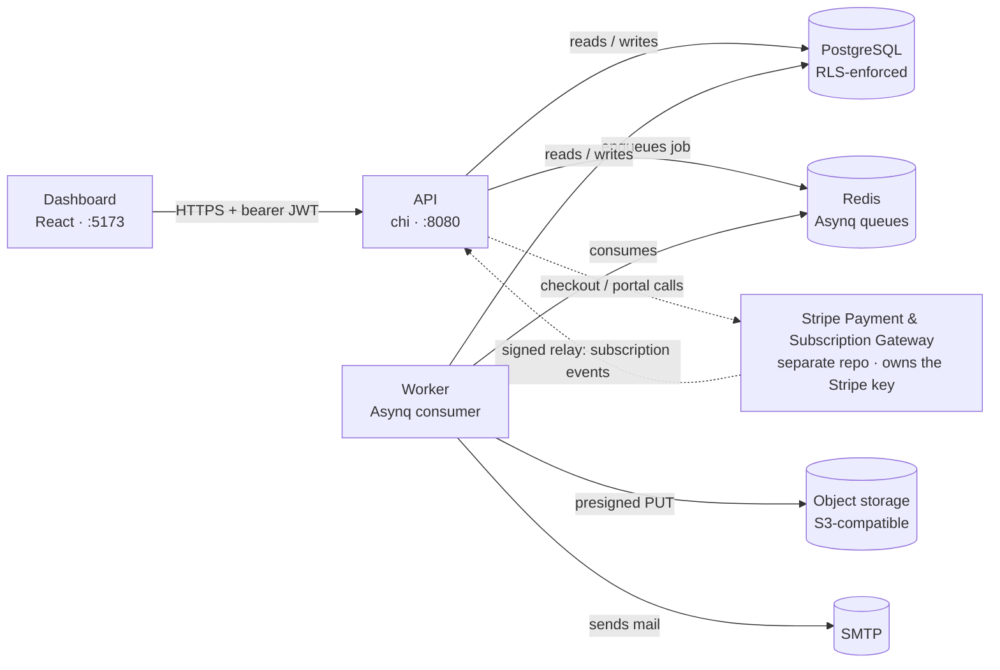
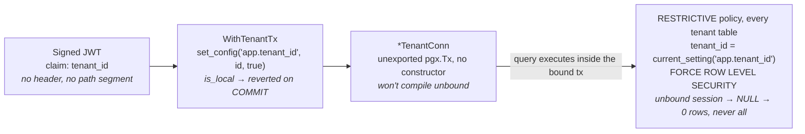
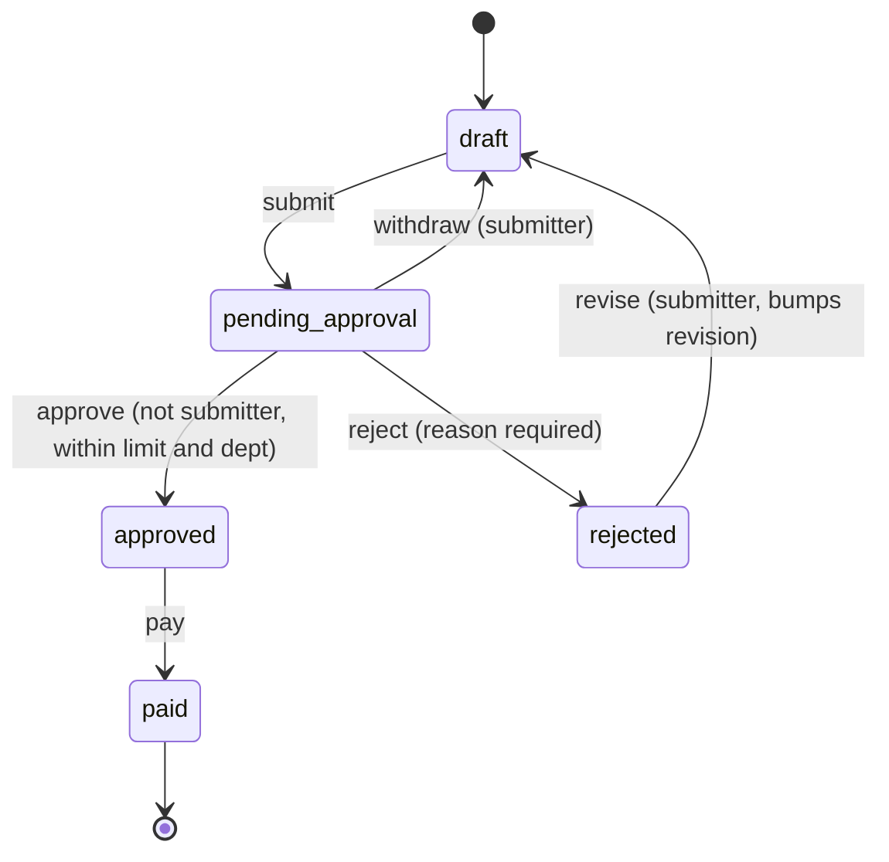

# Multi-Tenant B2B Expense & Team Budget Tracker

Expense claims, department budgets and recurring software spend for small
businesses and agencies. Go, PostgreSQL, one binary for the API and one for the
background workers, a React dashboard on top.

**Go 1.25 · PostgreSQL 16 · pgx/v5 · sqlc · chi · Redis + Asynq · React 19**

---

## The dashboard

<table>
<tr>
<td width="50%">

**Overview** — claims by status, committed spend by department


</td>
<td width="50%">

**Expenses** — filters, search, export, per-row actions


</td>
</tr>
<tr>
<td width="50%">

**Approvals** — oldest first, decisions scoped by role


</td>
<td width="50%">

**Budgets** — consumption against ceiling, alert threshold


</td>
</tr>
<tr>
<td width="50%">

**Organisation → Members** — roles, departments, approval limits


</td>
<td width="50%">

**Organisation → Subscriptions** — recurring vendor spend, annualised


</td>
</tr>
</table>

---

## Running it

```bash
cp .env.example .env
make up            # postgres, redis, minio, mailpit
make migrate-up
make seed          # a demo organisation with claims in every state

make run           # API on :8080
make run-worker    # background jobs, in another shell
make web           # dashboard on :5173, in a third shell
```

Sign in at <http://localhost:5173> as any of the seeded people — each shows a
different slice of the product:

| | | |
|---|---|---|
| `ada@acme.test` | owner | everything, including billing |
| `grace@acme.test` | manager | the approver queue, scoped to Engineering |
| `katherine@acme.test` | finance | settles approved claims, cannot approve |
| `margaret@acme.test` | member | files claims, sees only her own |

Password for all of them: `correct-horse-battery`.

Or containerised, no local Go or Node toolchain needed:

```bash
docker compose -f docker-compose.yml -f docker-compose.stack.yml up --build
```

---

## What it does

A claim moves through a state machine — draft, pending approval, approved or
rejected, paid — with every transition permission-checked, and the caller's
`allowed_actions` computed by the server so the client never re-implements the
rules. Department budgets track committed spend (approved and paid claims,
not pending ones) and raise an alert past a configurable threshold. Vendor
subscriptions turn into draft claims automatically on their charge date, so a
renewal never surprises finance at reconciliation time. Every decision is
exported as a streaming CSV, XLSX or PDF, and every state change is written to
an append-only ledger nothing can edit.

Subscription billing for the organisation itself is delegated to a companion
service, the [Stripe Payment & Subscription
Gateway](https://github.com/mlkad/stripe-payment-service) — see
[docs/BILLING_INTEGRATION.md](docs/BILLING_INTEGRATION.md) for the contract
between the two.

---

## Why it's built this way

### System topology



The dashboard only ever calls the API — never Postgres, Redis or the gateway
directly. The worker is what actually reaches object storage and SMTP, so a
slow upload or mail provider never holds an API request open. Billing is a
signed relay in, not a live call out, on every request.

### Tenant isolation, three layers



Three independent checks, not one mechanism repeated: the JWT is the only
place a tenant id comes from, the Go type system refuses to run a query
without a bound transaction, and Postgres refuses a mismatched row even to
the table's owner. The one deliberate widening, `WithSystemTx`, is for jobs
that legitimately span tenants — logged at `warn` on every call.

Five failure modes here each have their own test, verified by breaking the
code first and watching the test catch it: a session-level `SET` leaking a
tenant id across a pooled connection, connecting as a role RLS doesn't apply
to, a permissive policy accidentally widening access, a race between two
approvers on the same claim, and a streamed export holding the whole file in
memory.

### The approval flow is a table, not a switch statement



Transitions are rows in a table — `from`, `action`, `to`, the permission and
guards required — so a test asserts directly that every state is reachable,
every non-terminal state has an exit, and no transition skips its checks.
Three absences carry as much meaning as the edges: no `rejected → pending`
(a resubmission always bumps the revision counter), no `approved → rejected`
(a mistaken approval is corrected with a compensating claim, not by rewriting
history), and `paid` has no way out. Separation of duties is enforced per
claim — nobody decides on their own submission, and the approver of a claim
is not the one who settles it.

### Everything else in one pass

- **Exports stream.** XLSX is a ZIP of XML written straight onto the response
  socket, PDF holds one page at a time, CSV holds one row — heap usage at
  1,000 rows and 200,000 rows comes out the same.
- **Object storage does the work an API server shouldn't.** Receipts and
  exports move through short-lived signed URLs; a 25 MB upload never passes
  through the process holding a database connection.
- **The API contract is checked, not just written.** [`api/openapi.json`](api/openapi.json)
  — 47 operations, OpenAPI 3.1 — is verified against the live chi router in
  both directions on every test run.

---

## Layout

```
cmd/api                      HTTP server
cmd/worker                   Asynq workers and scheduler
cmd/migrate                  Migration runner, migrations embedded

internal/domain              Entities, the state machine, the permission matrix.
                              No I/O, no imports from the rest of the project.
internal/platform/postgres   Pool and the tenant transaction boundary
internal/repository/postgres sqlc-generated queries and the mapping to domain
internal/service             Transaction scope, orchestration
internal/transport/http      Router, middleware, handlers
internal/export              Streaming CSV, XLSX and PDF encoders
internal/gateway             Client and relay for the billing service
internal/storage             S3-compatible object store, SigV4 presigning
internal/worker              Background jobs

db/migrations                goose migrations, row-level security policies
db/queries                   Hand-written SQL, compiled by sqlc
test/integration             Real PostgreSQL, MinIO and Mailpit via testcontainers
web                           React dashboard — see web/README.md
```

---

## Development

```bash
make tools               # goose and sqlc
make test                # unit tests, -race
make test-integration    # spins up its own PostgreSQL, MinIO and Mailpit
make cover               # combined unit + integration coverage
make check               # fmt, vet, test
make openapi-validate    # api/openapi.json against the OpenAPI 3.1 schema

make web-check            # dashboard: typecheck, lint, unit tests
make web-smoke             # drives the running dashboard with a real browser
```

Two container images build from one Dockerfile by build stage: `api` and
`worker` are `FROM scratch`, running as a non-root user with no shell and no
package manager. The migration image is the one exception — `alpine` with
`psql`, for the moment a migration needs a human at a prompt.
